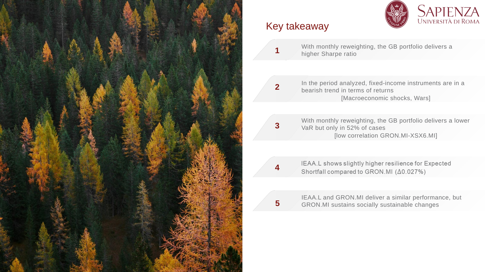

# green-bond-etf-vs-corporate-bond
This study analyzes the role of Green Bonds in institutional portfolios, assessing whether sustainable instruments affect traditional portfolio management. It compares green bond ETFs and corporate bonds using risk-adjusted and downside risk measures to evaluate performance and resilience


# Green Bonds in Institutional Investors’ Portfolios

## One-liner
An empirical analysis of whether Green Bonds can be integrated into institutional portfolios without compromising risk-adjusted performance and downside risk control.

---

## Research question
Can Green Bonds be effectively included in institutional investors’ portfolios without altering the traditional risk–return trade-off?  
How do Green Bond portfolios compare to conventional corporate bond portfolios in terms of profitability, downside risk, and tail-risk resilience?

---

## Dataset
- **Market**: Europe  
- **Period**: July 2021 – July 2025  
- **Frequency**: Daily prices (1,043 observations after cleaning)  
- **Assets (ETFs)**:
  - `XSX6.MI` – Equity ETF  
  - `GRON.MI` – Green Bond ETF  
  - `IEAA.L` – Corporate Bond ETF  
  - `IPRE.DE` – Real Estate ETF  
- **Price source**: Yahoo Finance  
- **Risk-free rate**: Kenneth French Data Library  

---

## Methodology
The analysis compares two institutional-style multi-asset portfolios:
- **Green Bond portfolio (GB)**  
- **Corporate Bond portfolio (CB)**  

Both portfolios follow the same asset-class logic (equity, bonds, real estate) to ensure comparability.

Performance and risk are evaluated using:
- **Sharpe Ratio** (risk-adjusted performance)
- **Value at Risk (VaR, 95%)** (downside risk)
- **Conditional Value at Risk (CVaR, 95%)** (tail risk / resilience)

Portfolio optimization is conducted under realistic constraints:
- No short-selling  
- No leverage (weights sum to 1)

Two strategies are implemented:
- **Constant-weight optimization**
- **Monthly re-optimization** (used as a stress test, ignoring transaction costs)

---

## Key results
- Green Bonds show **lower correlation with equities** than corporate bonds, providing diversification benefits.
- Under **monthly re-optimization**, Green Bond portfolios achieve a **higher Sharpe Ratio**, though not always higher cumulative returns.
- In **tail-risk minimization (CVaR)**, Corporate Bond portfolios display slightly stronger resilience during the 2022 fixed-income shock.



---

## How to run
1. Clone the repository  
   ```bash
   git clone https://github.com/nardonifederico1/Green-Bonds-in-institutional-investors-portfolios-R-studio-.git
